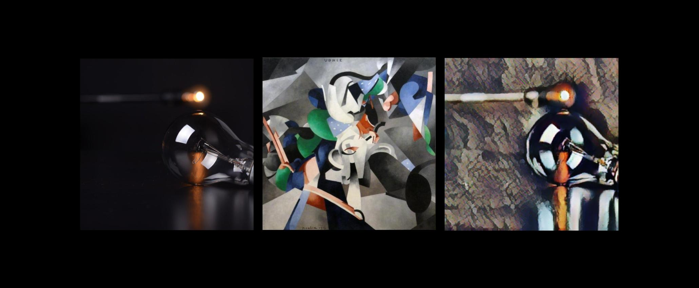

Este é o primeiro post de uma série voltada para o desenvolvimento de uma aplicação de Machine Learning (ML) do início ao fim (end-to-end) utilizando [Flutter](https://flutter.dev/) e [TensorFlow](https://www.tensorflow.org/). Vamos implementar um app que faz a transferência de estilo de uma imagem para as fotos tiradas com o celular utilizando Machine Learning. Uma técnica conhecida como [Neural Artistic Style Transfer](https://arxiv.org/abs/1508.06576).

Nos primeiros post do blog, apresentei um pouco da minha história com [Inteligência Artificial e Machine Learning](https://matheper.com/2020/06/28/minha-hist%C3%B3ria-com-intelig%C3%AAncia-artificial-e-machine-learning/) e compilei uma [lista de materiais](https://matheper.com/2020/07/22/primeiros-passos-machine-learning-e-deep-learning/) que me ajudaram durante meu processo de aprendizagem de ML. Agora chegou a hora de colocar a mão na massa e implementar uma aplicação real que utilize Machine Learning e Deep Learning.

Vamos desenvolver um app de celular com Flutter e integrar um modelo de Machine Learning implementado em TensorFlow. Nesta integração, utilizaremos o framwork [TensorFlow Lite](https://www.tensorflow.org/lite), que é uma extensão do TensorFlow para dispositivos móveis e Internet das Coisas.

A aplicação funcionará transferindo o estilo de uma image (style) a qualquer foto que você capturar com sua câmera (content). O resultado é uma imagem misturada (pastiche), como em um filtro de um editor de imagem, porém totalmente gerada por um modelo de Machine Learning.

Vamos utilizar o site oficial do [TensorFlow Lite](https://www.tensorflow.org/lite/models) como material de referência, em específico este artigo sobre [Artistic Style Transfer with TensorFlow Lite](https://www.tensorflow.org/lite/models/style_transfer/overview), que também está disponível no [GitHub](https://github.com/tensorflow/examples/tree/master/lite/examples/style_transfer/android).

A série não será exatamente um tutorial, pois algumas tecnologias são totalmente novas para mim. Em vez disso, será um diário de bordo onde compartilharei o processo de desenvolvimento e os desafios envolvidos na implementação de uma aplicação de Machine Learning do início ao fim.

É possível que o planejamento que estou compartilhando agora mude ao longo do tempo, pois esta é uma aplicação que estou desenvolvendo enquanto escrevo cada publicação. Entretanto, espero que ao final tenhamos aprendido os seguintes tópicos:

* Implementar um app simples em Flutter
	* Instalar e configurar o Flutter
	* Criar um app simples
	* Utilizar a câmera do celular para tirar fotos
* Integrar modelos de Machine Learning em apps mobile
	* Interagir com modelos ML utilizando TensorFlow Lite
	* Integrar TensorFlow Lite e Flutter
* Aprender conceitos básicos de Machine Learning
	* Pré-processamento de imagens
	* Redes Neurais Convolucionais (CNNs)

Nesta série, vamos fazer o processo inverso do que costumo encontrar na internet. Ao contrário de materiais que começam com ML e quase nunca chegam até a etapa de aplicação dos modelos, vamos primeiro construir uma aplicação simples, depois integrar um modelo de ML já treinando e, finalmente, partir para as técnicas de Machine Learning tentando aprimorar nosso sistema.

Então fique ligado nos próximos posts para descobrir mais sobre integração de Machine Learning em aplicativos mobile.