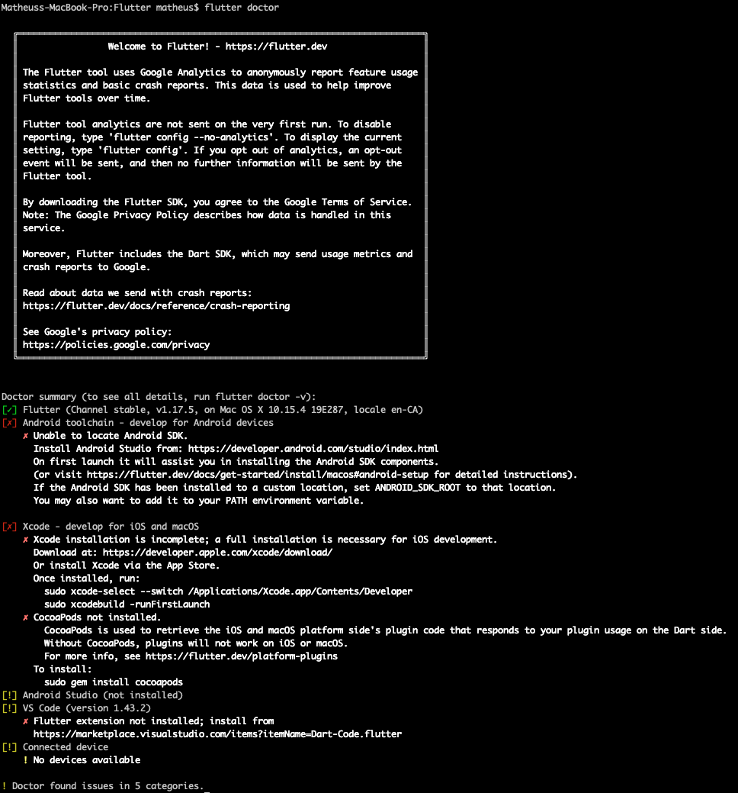
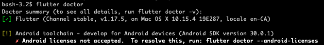
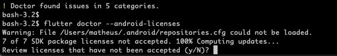
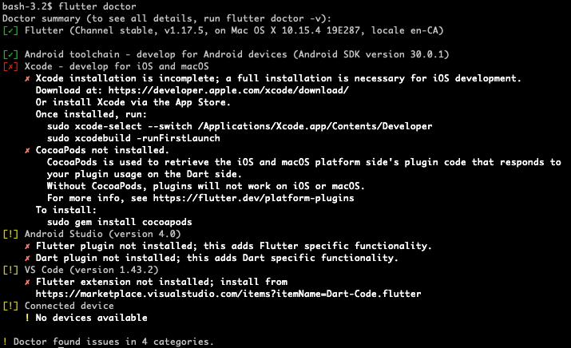
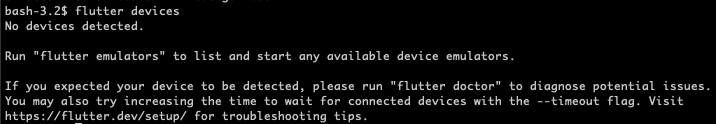
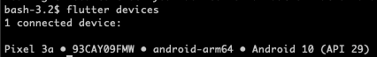
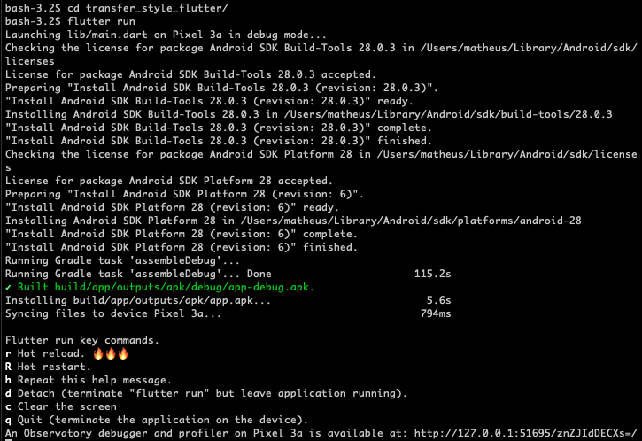

No primeiro post da série [Transferência de Estilo com Flutter e TensorFlow]() apresentei uma visão geral da nossa aplicação e alguns dos tópicos que iremos abordar durante o desenvolvimento desse projeto.

Como a ideia é utilizar [Flutter](https://flutter.dev) e [TensorFlow Lite](https://www.tensorflow.org/lite/), vamos começar instando e testando o Flutter, principalmente pois não tenho certeza sobre seu suporte ao TFLite. Para isso, vou seguir os [primeiros passo](https://flutter.dev/docs/get-started)  do site oficial que incluem [instalação](https://flutter.dev/docs/get-started/install), [configuração](https://flutter.dev/docs/get-started/editor) e [test drive](https://flutter.dev/docs/get-started/test-drive).

## O que é Flutter

Flutter é um kit de ferramentas da interface do usuário (UI toolkit) do Google que utiliza [Dart](https://dart.dev/), também desenvolvida pelo Google, como linguagem de programação.

A proposta do Flutter é permitir o desenvolvimento de aplicativos para multiplas plataformas a partir de uma única base de código. Isso significa que você pode gerar um app Android e um app iOS utilizando o mesmo código fonte.

Essa é uma ideia que existe a algum tempo, já que em teoria é muito mais simple desenvolver e manter um software que é escrito uma única vez, ao contrário de, por exemplo, ter uma implementação específica para Android em [Kotlin](https://kotlinlang.org/) e uma para iOS em [Swift](https://developer.apple.com/swift/).

Além de Flutter, existem outras tecnologias com a mesma proposta, como [React Native](https://reactnative.dev/), [Ionic](https://ionicframework.com/) e [PhoneGap](https://phonegap.com/). A motivação principal é sempre a mesma, um código único para multiplas plataformas. Esta técnica é conhecida como desenvolvimento mobile híbrido.

### Web x Nativo x Híbrido

Imagine que um de seus clientes precisa de uma solução mobile para seu negócio. Ele tem, por exemplo, um site e-commerce e agora quer melhorar a experiência do usuário que utiliza o smartphone para fazer compras.

#### Web

Se o site for responsivo, o usuário pode utilizar o navegador web para fazer suas compras, mas sua experiência será limitada. Ele precisa acessar o navegador, provavelmente digitar a URL do site, acessar a área de login, acessar sua conta e só então efetuar a compra.

Os recursos mobile que você teria acesso como desenvolvedor também são limitados, já que muitas funções, como push notification, não estão disponíveis no navegador por questões de segurança. Além disso, seu sistema não terá a mesma performance que uma aplicação nativa pode proporcionar.

Um ponto positivo desta solução é que você não tem um aplicativo para manter, mas você abre mão, principalmente, da experiência de usuário.

#### Nativo

Está é a melhor solução em relação a capacidade de personalização, acesso aos recursos e performance quando desenvolvemos um app mobile.

Ao desenvolver um aplicativo nativo, você tem acesso total aos recursos do celular e pode personalizar a experiência do usuário como melhor convir. No geral, seu aplicativo também executará mais rápido do que um sistema web, pois não existe a camada do navegador entre o app e o dispositivo móvel.

Os pontos negativos estão relacionados ao fato de você precisar de uma implementação específica para Android e uma para iOS. O que significa implementação e manutenção em dobro, além da necessidade de pessoas com conhecimento em diferentes linguagens de programação.

#### Híbrido

O desenvolvimento híbrido tenta combinar as duas abordagens para ter acesso aos recursos e capacidade de personalização de um sistema nativo, ao mesmo tempo que mantém um único código fonte.

Com Flutter, por exemplo, você implementa seu app uma única vez utilizando Dart e pode compilar tanto para Android quanto para iOS. Você tem acesso aos recursos do celular e a um conjunto de componentes de interface de usuário como [Material Design](https://flutter.dev/docs/development/ui/widgets/material) e [Cupertino](https://flutter.dev/docs/development/ui/widgets/cupertino).

A principal desvantagem do desenvolvimento híbrido é que você tem uma camada intermediária de código, de um framework que não é o código nativo do seu app.

Isso acaba limitando a capacidade do seu app à própria capacidade do framework. Quanto mais complexo o app, mais difícil é manter a compatibilidade entre plataformas.

A partir de algumas experiências que tive com Ionic, posso dizer que algumas coisas acabam não funcionando como o esperado e você precisará implementar parte de seu app de forma nativa.

Como resultado final você tem um bom aplicativo, mas que não é tão bom quanto um aplicativo nativo. Você tem um único código, mas na verdade ainda precisa lidar com algumas partes escritas especificamente para Android ou iOS.

Sendo assim, se você precisar de um aplicativo simple, para Android e iOS, e contar com recursos limitados, então a abordagem híbrida é um bom caminho a seguir. Entretando, se seu aplicativo é complexo ou existem planos para ele crescer ao longo do tempo, o mais seguro é já começar com uma implementação nativa.

Em nosso projeto, o aplicativo será relativamente simples e não tenho a intenção de expandir seu escopo para além da transferência de estilo. Por isso a escolha de Flutter (também porque estava curioso com seu funcionamento).

## Instalando Flutter com snaps

Se você utiliza uma distribuição baseada em Ubuntu, pode usar o sistema de snaps para instalar o [Android Studio](https://snapcraft.io/install/android-studio/ubuntu#install) e o [Flutter](https://snapcraft.io/flutter) com apenas dois comandos:

```
sudo snap install android-studio --classic
sudo snap install flutter --classic
```

Com o sistema de snaps você não precisa se preocupar com nenhuma configuração de ambiente. Fiz alguns testes em uma máquina virtual e, utilizando apenas os comandos acima, já tinha o comando `flutter` disponível no terminal, assim como o Android Studio configurado e disponível nos meus aplicativos do sistema.

## Instalando Flutter

Caso você utilize linux mas não possa ou não queira utilizar o sistema de snaps, você pode seguir as [instruções de instação para Linux](https://flutter.dev/docs/get-started/install/linux). O mesmo vale para [Windows](https://flutter.dev/docs/get-started/install/windows), [MacOS](https://flutter.dev/docs/get-started/install/macos) e [ChromeOS](https://flutter.dev/docs/get-started/install/chromeos). No meu caso vou utilizar as instruções para MacOS.

Conforme descrito no [Get Started para MacOS](https://flutter.dev/docs/get-started/install/macos), baixei e descompactei o arquivo zip, configurei a variável de ambiente PATH, incluindo o caminho onde estão os arquivos que acabei de baixar, e já tenho o comando `flutter` disponível no meu terminal.

Ao rodar o comando `flutter doctor`, que faz um diagnóstico da instalação, descobri que ainda preciso instalar algumas dependências. Como era de se esperar, é necessário instalar o Android toolchain para desenvolvimento Android e o Xcode para desenvolvimento iOS.



Por enquanto vou focar no desenvolvimento Android, então vou tentar instalar apenas o Android toolchain.
Seguindo os primeiros passos do Flutter, pulei as etapas de instalação iOS e cheguei até a [instalação do SDK Android](https://flutter.dev/docs/get-started/install/macos#android-setup).

Fiz o download, instalei e configurei o SDK, conectei meu celular na USB, ativei o modo de desenvolvedor e rodei o comando  `flutter doctor` novamente.



Desta vez, descobri que preciso aceitar as licenças de desenvolvimento do Android, rodei novamente o comando doctor, agora com a flag --android-licenses: `flutter doctor --android-licenses`.



Aceitei todas as licenças e agora o sdk está pronto.



O diagnóstico ainda reclama que o Xcode não está instalado, mas como não vou programar para iOS, está tudo certo. Ele também alerta que os plugins para o Android Studio e o VS Code não estão instalados. Por enquanto também não vou me preocupar com isso.

O último alerta me interessa, ele diz que não tenho um dispositivo conectado, mas meu celular está na USB e está em [modo de desenvolver](https://developer.android.com/studio/debug/dev-options). Imagino que rodar o comando `flutter devices` não vai resolver, mas vamos testar de qualquer forma.



Ele sugere rodar `flutter emulators`. Você pode criar um emulador Android com o mando `flutter emulators --create --name nome_do_emulador`. Eu quero testar diretamente no celular, então vamos tentar resolver o problema com o device.

Depois de algum tempo pesquisando e mexendo nas configurações do celular me dei conta de que precisava ativar a opção USB debugging. Logo depois de ativar o debug USB, rodei o comando `flutter devices`, aceitei um diálogo de autorização no celular e, finalmente, tudo pronto.



## Primeiro App Flutter

Com o Flutter e o Android SDK instalados e configurados, e o celular conectado, já podemos criar nosso primeiro app de teste. Para isso eu simplemente rodei os comandos `flutter create nome_do_app` e `flutter run` de dentro da pasta criada pelo primeiro comando.

```
flutter create transfer_stype_flutter
cd transfer_stype_flutter
flutter run
```



Se você preferir, pode [instalar os plugins para o Android Studio ou VSCode](https://flutter.dev/docs/get-started/editor?tab=vscode) e [criar seu app de teste](https://flutter.dev/docs/get-started/test-drive?tab=vscode) pela interface do seu editor.

Com isso já temos nosso primeiro app Flutter rodando e podemos seguir adiante com nossos testes.

O próximo objetivo é integrar um recurso nativo do celular. No caso, a câmera para tirar fotos que serão utilizadas como conteúdo da nossa transferência de estilo. Além disso, precisamos iniciar nossos testes de integração do TensorFlow Lite com Flutter. Honestamente, este é o ponto de maior risco do nosso projeto.

Então fique ligado nos próximos posts.