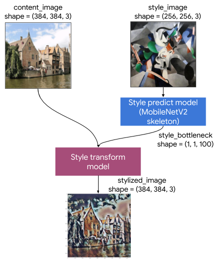
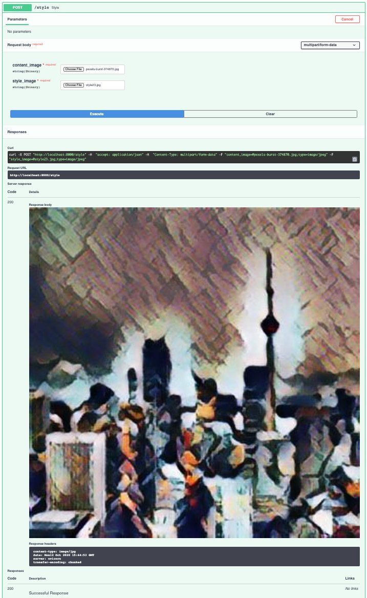

Este é o sexto post da série Transferência de Estilo com Flutter, FastAPI e TensorFlow. Nesta série, estou documentando minha experiência desenvolvendo uma aplicação de Machine Learning (ML) do início ao fim.

* [Parte 1 - Transferência de Estilo com Flutter e TensorFlow]()
* [Parte 2 - Primeiros Passos com Flutter]()
* [Parte 3 - Flutter e suporte ao TensorFlow Lite]()
* [Parte 4 - Machine Learning no Device ou Servidor]()
* [Parte 5 - Implementando API de Imagens com FastAPI]()

Acabei sendo mais rápido para implementar a aplicação do que para publicar no blog. Se você quiser, já pode acessar o [código completo no GitHub](https://github.com/matheper/style_transfer).

## Introdução
No [post anterior](), criamos uma endpoint simple que recebe e retorna uma imagem utilizando Python e FastAPI. Hoje, vamos finalizar a implementação do backend seguindo os seguintes passos:

* estender o endpoint `/style` para receber duas imagens
* revisar a lógica do [Notebook original](https://www.tensorflow.org/lite/models/style_transfer/overview) para adaptá-lo e integrá-lo ao backend FastAPI
* criar funções de conversão entre `io.BytesIO` e `tf.Tensors`
* aplicar uma função de pré-processamento de imagens
* aplicar a transferência de estilo com os Modelos TensorFlow Lite
* retornar a imagem estilizada como um `StreamingResponse`

## Endpoint `/style`

Vamos começar nossa implementação refatorando o endpoint `/style` para receber duas imagens. Para isso, vamos editar a função `predict` do arquivo `main.py`. Vamos renomear a função de `predict` para `style` e receber dois parâmetros: `content_image` e `style_image`.

```
@app.post('/style')
async def style(content_image: bytes = File(...),
                style_image: bytes = File(...)):
    content_img = io.BytesIO(content_image)
    style_img = io.BytesIO(style_image)
    content_img.seek(0)
    return StreamingResponse(
        content_img,
        media_type="image/jpg",
    )
```

## Revisando o notebook de transferência de estilo

O [notebook de transferência de estilo](https://www.tensorflow.org/lite/models/style_transfer/overview) que estamos utilizando como base para nossa implementação é organizado da seguinte forma (você pode alterar o idioma para Português):

* Arquitetura do Modelo
* Configuração
* Pré-processamento
* Visualização
* Transferência de estilo
* Benchmarks de desempenho

Neste post, vamos revisar as seções  que são relevantes para a integração com o backend FastAPI: arquitetura do modelo, pré-processamento e transferência de estilo. Você pode conferir o restante diretamente na página do TensorFlow.

Também é possível executar o notebook passo a passo e combinar suas próprias imagens pelo [Google Colab](https://colab.research.google.com/github/tensorflow/tensorflow/blob/master/tensorflow/lite/g3doc/models/style_transfer/overview.ipynb), que é um [Jupyter Notebook](https://jupyter.org/) que o Google disponibliza para projetos de pesquisa e educação.


### Arquitetura do modelo

Por enquanto, vamos considerar o modelo de transferência de estilo uma caixa fechada. Só vamos abrir esta caixa depois que o app estiver rodando. Mesmo assim, é importante termos uma ideia geral do seu funcionamento.

O básico que precisamos entender é que, na verdade, o processo de transferência de  estilo utiliza dois modelos: um para identificar o estilo que será aplicado, e um para aplicar este estilo à imagem de conteúdo.



Fonte: [tensorflow.org](https://www.tensorflow.org/lite/models/style_transfer/overview)

O primeiro modelo é uma rede neural baseada em [MobilenetV2](https://arxiv.org/abs/1801.04381), que recebe a imagem de estilo e calcula um vetor de gargalo (`bottleneck`). Simplificando, o bottleneck é uma representação numérica do estilo.

O segundo modelo recebe a imagem de conteúdo e o bottleneck de estilo. O modelo combina esse bottleneck à imagem original, gerando uma nova imagem estilizada.

Também é importante perceber que os modelos utilizam imagens de tamanhos específicos.

O modelo que calcula o estilo espera uma imagem com shape=(256, 256, 3), ou seja, uma imagem RGB com 256px de altura e 256px de largura. A saída deste modelo é o bottleneck, um vetor de três dimenções com shape=(1, 1, 100).

O modelo que aplica o estilo espera uma imagem com shape=(384, 384, 3), ou seja, uma imagem RGB de 384px por 384px. O modelo também recebe o bottleneck de estilo, que é a saída da execução do primeiro modelo.

O resultado é um imagem estilizada também com shape=(384, 384, 3).

### Pré-processamento e Transferência de estilo

Como acabamos de revisar, os modelos para transferência de estilo esperam imagens de tamanhos bem específicos: estilo de 256x256 e conteúdo de 384x384. Porém, como queremos que o algoritmo funcione para imagens de qualquer tamanho, vamos aplicar uma função de pré-processamento que consiste em dois passos:

* Redimensionar a menor dimensão para a dimensão que desejamos, seja 256px ou 384px
* Fazer um corte centralizado da maior dimensão, deixando a imagem com as mesmas dimensões de altura e largura

Após redimensionar as imagens para os tamanhos apropriados, acontece a transferência de estilo, que também pode ser organizada em dois passos:

* Extração das características da imagem de estilo, quando o primeiro modelo faz o cálculo do bottleneck
* Transferência de estilo, quando o segundo modelo utiliza o bottleneck e a imagem de conteúdo para gerar uma nova imagem estilizada

Você encontrará mais detalhes sobre a implementação logo abaixo, nas seções Pré-processamento e Transferência de estilo.

## Instalando Dependências
Vamos começar instalando as dependências necessárias para esta etapa da implementação: [TensorFlow](https://www.tensorflow.org/install) para interagir com os modelos de Machine Learning e [Pillow](https://pillow.readthedocs.io/en/stable/installation.html#basic-installation) para nos ajudar com a manipulação das imagens.

```shell
pip install tensorflow
pip install Pillow
```

Você pode adicionar um [arquivo de `requirements`](https://github.com/matheper/style_transfer/blob/main/fastapi_serving/requirements.txt) na raiz do projeto para manter suas dependências organizadas.

## (re)Refatorando o endpoint `/style`

Começamos carregando e manipulando as imagens que recebemos pelo endpoint `style` no mesmo arquivo `main.py` em que definimos a API do nosso backend. Para o nosso projeto, que é relativamente simples, isso não seria um problema. 

Porém, à medida que o projeto começa a crescer, é importante que o código esteja organizado de forma que seus componentes tenham responsabilidades bem definidas.

As duas responsabilidades do nosso backend Python (por enquanto) são:

* Disponibilizar uma API para a transferência de estilo, que será consumida pelo APP Flutter
* Aplicar a transferência de estilo a partir de uma imagem de conteúdo e uma imagem de estilo


Mesmo nosso projeto sendo pequeno, é uma boa prática planejar a organização e o escopo de cada componente do sistema logo no início. Isso porque, na maioria dos casos, não é possível prever se, ou quando, o escopo do projeto irá mudar ou crescer.

Quanto mais tarde você decidir organizar seu projeto, mais trabalho você terá para fazê-lo.
Então, vamos começar agora mesmo separando a lógica relacionada à transferência de estilo da lógica da API.

Para isso, criamos um novo arquivo chamado `style_transfer.py`. Todo o código relacionado à manipulação das imagens e transferência de estilo estará neste arquivo.

Com esta organização, o arquivo `main.py` será responsável apenas pelo código da API. Vamos refatorá-lo para enviar as imagens de conteúdo e estilo à função `apply_style`, que será implementada no arquivo `style_transfer.py`:

```
import io

from fastapi import FastAPI
from fastapi import File
from starlette.responses import StreamingResponse

from style_tranfer import apply_style

app = FastAPI()


@app.post('/style')
async def style(content_image: bytes = File(...),
                style_image: bytes = File(...)):

    stylized_image = apply_style(
        io.BytesIO(content_image),
        io.BytesIO(style_image),
    )

    return StreamingResponse(
        stylized_image,
        media_type="image/jpg",
    )
```


## Carregando imagens com Pillow e TensorFlow

Após criar o arquivo `style_transfer.py` na raiz do projeto (mesmo diretório onde está o arquivo `main.py`), é hora de implementar a função `apply_style`.

Esta função deve receber a imagem de conteúdo e a imagem de estilo e, ao final, retornar a imagem já estilizada. Porém, enquanto não temos a implementação completa, vamos retornar a própria imagem de conteúdo.

Também já podemos implementar uma função que carregue a imagem [io.BytesIO](https://docs.python.org/3/library/io.html#io.BytesIO) que recebemos pela API como [tf.Tensors](https://www.tensorflow.org/guide/tensor) e a função inversa que transforma `tensors` de volta para `bytes` utilizando as libs `Pillow` e `TensorFlow`. 

Desta forma, já temos as funções que fazem as transformações entre os formatos corretos para os modelos de Machine Learning com TensorFlow (`tf.Tensors`) e o endpoint `/style` com FastAPI (`io.BytesIO`).

```
import io

import tensorflow as tf
from PIL import Image


def img_bytes_to_array(img_bytes: io.BytesIO) -> tf.Tensor:
    """Loads an image from a img bytes into a tf tensor.
    Rescales RGB [0..255] to [0..1] and adds batch dimension.
    """
    img = tf.keras.preprocessing.image.img_to_array(
        Image.open(img_bytes)
    )
    img = img / 255  # convert [0..255] to float32 between [0..1]
    img = img[tf.newaxis, :]  # add batch dimension
    return img


def array_to_img_bytes(img_array: tf.Tensor) -> io.BytesIO:
    """Loads a tf tensor image into a img bytes.
    Rescales [0..1] to RGB [0..255] and removes batch dimension.
    """
    if len(img_array.shape) > 3:  # remove batch dimension
        img_array = tf.squeeze(img_array, axis=0)
    img_array = img_array * 255  # convert [0..1] back to [0..255]
    img = tf.keras.preprocessing.image.array_to_img(img_array)
    img_buffer = io.BytesIO()
    img.save(img_buffer, format='jpeg')
    img_buffer.seek(0)
    return img_buffer


def apply_style(content_image: io.BytesIO,
                style_image: io.BytesIO) -> io.BytesIO:
    content_img = img_bytes_to_array(content_image)
    style_image = img_bytes_to_array(style_image)

    stylized_image = array_to_img_bytes(content_img)

    return stylized_image
```

A função `img_bytes_to_array` carrega uma imagem `io.BytesIO` em `tf.Tensor`. A função também transforma a representação RGB [0..255] para floats entre [0..1]. Por fim, é adicionada uma dimensão extra de batch, ou seja, a imagem é colocada em um lista de um único elemento, já que os modelos que vamos utilizar esperam receber uma lista de imagens.

A função `array_to_img_bytes` faz o oposto, recebe um `tf.Tensor`, remove a dimensão extra de batch, transforma os valores float entre [0..1] de volta para a representação RGB [0..255] e carrega a imagem de volta para um `io.BytesIO`.

Com isso, podemos transformar as imagens de conteúdo e estilo de `io.BytesIO` para `tf.Tensors`, e de `tf.Tensors` de volta para `io.BytesIO`, como fizemos com a imagem de conteúdo na função `apply_style`.


## Pré-processamento

Agora já podemos aplicar o mesmo pré-processamento que o Notebook utiliza. A imagem de conteúdo deve ter as dimensões **384x284** e a imagem de estilo **256x256**.

```python
def preprocess(img_tensor: tf.Tensor, target_dim: int) -> tf.Tensor:
    """Pre-process by resizing an central cropping it."""
    # Resize the image so the shorter dimension becomes target_dim.
    shape = tf.cast(tf.shape(img_tensor)[1:-1], tf.float32)
    short_dim = min(shape)
    scale = target_dim / short_dim
    new_shape = tf.cast(shape * scale, tf.int32)
    img = tf.image.resize(img_tensor, new_shape)

    # Central crop the image so both dimensions become target_dim.
    img = tf.image.resize_with_crop_or_pad(img, target_dim, target_dim)
    return img


def apply_style(content_image: io.BytesIO,
                style_image: io.BytesIO) -> io.BytesIO:
    content_img = preprocess(img_bytes_to_array(content_image), 384)
    style_img = preprocess(img_bytes_to_array(style_image), 256)

    stylized_image = array_to_img_bytes(content_img)

    return stylized_image
```

A função `preprocess` recebe uma imagem em um `tf.Tensor`, faz o redimensionamento da menor dimensão para a dimensão desejada `target_dim`, e após faz o corte centralizado da maior dimensão também para a dimensão `target_dim`. O resultado é uma imagem com altura e largura iguais à `target_dim`.

Na função `apply_style` passamos a imagem carregada com a função `img_bytes_to_array` e a dimensão que desejamos, no caso 384 para a imagem de conteúdo e 256 para a imagem de estilo.

## Transferência de estilo


Com as funções de conversão e pre-processamento finalizadas, estamos prontos para implementar a transferência de estilo. Lembrando que a arquitetura do sistema utiliza dois modelos de ML: um para calcular o `bottleneck` de estilo e outro para aplicar o estilo à imagem de conteúdo.

Podemos separar a implementação da transferência de estilo em quatro itens:

* Download dos modelos
* Captura de estilo
* Transferência de estilo
* Algoritmo que conecta toda a lógica que desenvolvemos até aqui

### Download dos modelos
Precisamos carregar os dois modelos disponíveis na seção de [Benchmarks do Notebook original](https://www.tensorflow.org/lite/models/style_transfer/overview#performance_benchmarks): [style_prediction](https://tfhub.dev/google/lite-model/magenta/arbitrary-image-stylization-v1-256/int8/prediction/1?lite-format=tflite) e [style_transform](https://tfhub.dev/google/lite-model/magenta/arbitrary-image-stylization-v1-256/int8/transfer/1?lite-format=tflite). Crie uma nova pasta chamada `tf_models` na raiz do projeto e salve os dois modelos nesta pasta.

Em seguida, edite o arquivo `style_transfer.py` adicionando o caminho para os modelos que você acabou de baixar. Eu adicionei estas informações logo abaixo da seção de `import` do Python.

```python
import io

import tensorflow as tf
from PIL import Image


style_predict = 'tf_models/magenta_arbitrary-image-stylization-v1-256_int8_prediction_1.tflite'
style_transform = 'tf_models/magenta_arbitrary-image-stylization-v1-256_int8_transfer_1.tflite'
```

### Captura de estilo (style prediction)
Agora podemos criar uma função para carregar o modelo de predição em memória e calcular o bottleneck de estilo. Para [executar um modelo TensorFlow Lite](https://www.tensorflow.org/lite/guide/inference#running_a_model) podemos seguir uma receita de 5 passos:

* Carregar o modelo em memória
* Construir um `Interpreter` baseado em um modelo existente
* Definir os valores do tensor de entrada
* Invocar inferência
* Ler o resultado do tensor de saída

O código ficará parecido com o seguinte:

```python
def run_style_predict(style_img):
    """Runs style prediction on preprocessed style image."""
    # Load the model.
    interpreter = tf.lite.Interpreter(model_path=style_predict)

    # Set model input.
    interpreter.allocate_tensors()
    input_details = interpreter.get_input_details()
    interpreter.set_tensor(input_details[0]["index"], style_img)

    # Calculate style bottleneck.
    interpreter.invoke()
    output_details = interpreter.get_output_details()
    style_bottleneck = interpreter.tensor(output_details[0]["index"])()

    return style_bottleneck
```

Começamos carregando o modelo em memória (interpreter) e em seguida invocamos a função `allocate_tensors`. Carregamos os detalhes da camada de entrada e conectamos a imagem de estilo à entrada de dados do modelo. Executamos o modelo com `interpreter.invoke()` e, finalmente, lemos o resultado da camada de saída do modelo.

### Transferência de estilo (style transform)

Seguindo a mesma receita TFLite, a função para aplicar a estilização da imagem fica bem parecida com a função para calcular o bottleneck de estilo. A diferenca está no modelo que carregamos em memória (`style_transform`) e o fato de conectarmos duas informações à camada de entrada do modelo: a imagem de conteúdo e o bottleneck de estilo.

```python
def run_style_transform(style_bottleneck, content_img):
    """Runs style transform on preprocessed style image."""
    # Load the model.
    interpreter = tf.lite.Interpreter(model_path=style_transform)

    # Set model input.
    input_details = interpreter.get_input_details()
    interpreter.allocate_tensors()

    # Set model inputs.
    interpreter.set_tensor(input_details[0]["index"], content_img)
    interpreter.set_tensor(input_details[1]["index"], style_bottleneck)
    interpreter.invoke()

    # Transform content image.
    output_details = interpreter.get_output_details()
    stylized_image = interpreter.tensor(output_details[0]["index"])()

    return stylized_image
```

O restante do código segue o mesmo formato, executamos o modelo com `interpreter.invoke()` e lemos o resultado da camada de saída do modelo. Neste caso, o resultado é um tensor com a imagem já estilizada.

### Algoritmo principal: `apply_style`

Com todas as funções prontas, agora precisamos organizar a lógica do nosso algoritmo dentro da função `apply_style`.

```python
def apply_style(content_image: io.BytesIO,
                style_image: io.BytesIO) -> io.BytesIO:
    content_img = preprocess(img_bytes_to_array(content_image), 384)
    style_img = preprocess(img_bytes_to_array(style_image), 256)

    style_bottleneck = run_style_predict(style_img)
    stylized_image = run_style_transform(style_bottleneck, content_img)

    stylized_image = array_to_img_bytes(stylized_image)
    return stylized_image
```

O algoritmo fica bem simples com a organização que seguimos até aqui:

* A função `apply_style` recebe a imagem de conteúdo `content_image` e a imagem de estilo `style_image` em `io.BytesIO`
* Carregamos a imagem de conteúdo em um `tf.Tensor` com a função `img_bytes_to_array` e aplicamos a função `preprocess` redimencionando e cortando a imagem para que ela tenha as dimensões 384x384
* Aplicamos as mesmas funções à imagem de estilo, porém com as dimensões 256x256
* Calculamos o bottleneck de estilo com a função `run_style_predict(style_img)`
* Aplicamos a transferência de estilo com `run_style_transform(style_bottleneck, content_img)`
* Carregamos a imagem resultante de `tf.Tensor` de volta para `io.BytesIO`
* Retornamos a imagem estiliza

## Resultado final


Chegamos ao fim da nossa implementação Python. O backend escrito com FastAPI está pronto para receber duas imagens e combiná-las em uma mistura de estilo e conteúdo utilizando TensorFlow.

Você pode testar a implementação acessando a documentação OpenAPI em `http://localhost:8000/docs`. A API web pode ser consumida por qualquer cliente, seja uma aplicação web, um app mobile ou até outro serviço de backend.

Você também pode acessar o [código no github](https://github.com/matheper/style_transfer/tree/main/fastapi_serving) se tiver qualquer dúvida. No código do repositório também implementei um parâmetro adicional para selecionar o [percentual de mistura do estilo](https://www.tensorflow.org/lite/models/style_transfer/overview#style_blending).



## Próximos passos

Nos próximos posts, vamos voltar ao Flutter e implementar a aplicação que irá se comunicar com a API de estilização de imagens.

Durante o desenvolvimento do App Flutter vamos precisar:

* Capturar e exibir uma foto utilizando o recurso nativo de câmera
* Criar uma lista de estilos que o usuário poderá selecionar para a estilização da foto
* Conectar o app à API de transferência de estilo
* Criar uma apresentação para a imagem estilizada

Se você estiver gostando da série pode curtir, deixar um comentário ou compartilhar com seus amigos.

Até a próxima!